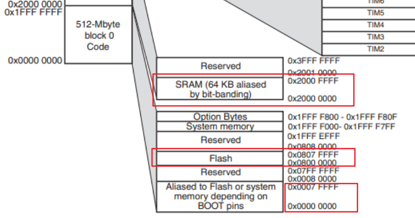
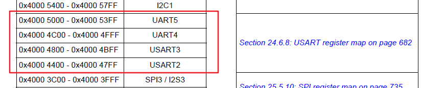
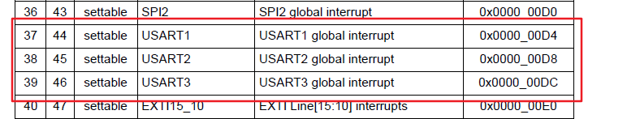
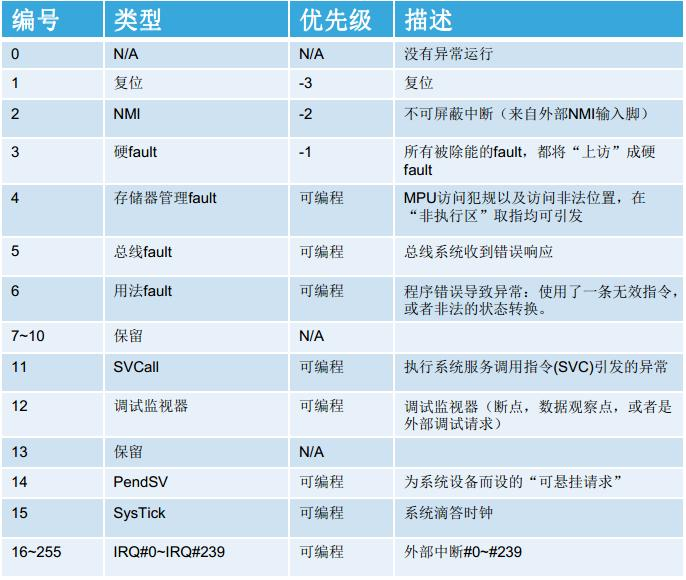
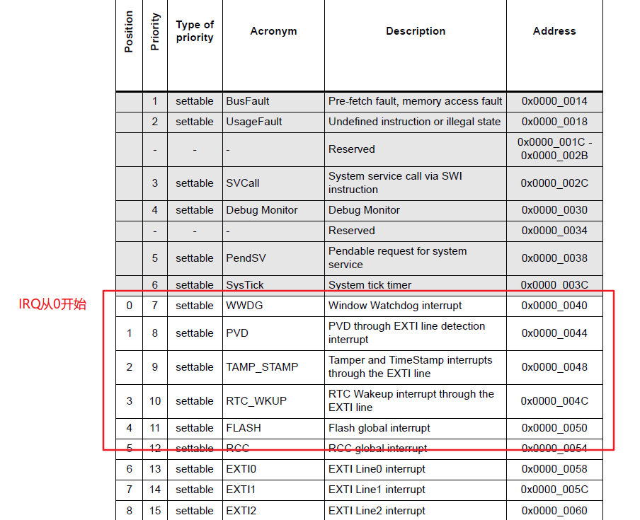

# 概述

上一篇文件介绍了luaqemu的实现，也提到luaqemu并没有对中断相关api进行封装，本节主要基于stm32f205-soc的实现来介绍中断的仿真，并提供一个用于测试qemu设备模拟的裸板程序来测试中断的仿真。

本文相关代码地址

```
https://github.com/hac425xxx/qemu-fuzzing/commit/609538e1407de884f6c9e4d222431c9032abc25b
https://github.com/hac425xxx/qemu-fuzzing/commit/7bc0e0aa35363c18fcf5b89dacab73a0a9bef147
```


# stm32f205-soc实现

为了仿真某个设备，我们需要通过阅读硬件文档或者通过逆向程序逻辑来获取外设的行为，然后再在qemu中进行模拟，stm32f205的手册可以直接在网上下载

```
https://www.st.com/resource/en/reference_manual/cd00225773-stm32f205xx-stm32f207xx-stm32f215xx-and-stm32f217xx-advanced-arm-based-32-bit-mcus-stmicroelectronics.pdf
```

qemu中名字为netduino2的Machine使用到了stm32f205-soc这个设备，可以使用 -M 指定使用该设备

```
qemu-system-arm -M netduino2 
```

netduino2的初始化函数为netduino2_init

```
static void netduino2_init(MachineState *machine)
{
    DeviceState *dev;

    dev = qdev_create(NULL, TYPE_STM32F205_SOC);
    qdev_prop_set_string(dev, "cpu-type", ARM_CPU_TYPE_NAME("cortex-m3"));
    object_property_set_bool(OBJECT(dev), true, "realized", &error_fatal);

    armv7m_load_kernel(ARM_CPU(first_cpu), machine->kernel_filename,
                       FLASH_SIZE);
}
```

函数逻辑如下：

1. 首先创建stm32f205-soc设备，然后设置cpu-type为 `cortex-m3`
2. 然后通过设置 realized 触发stm32f205_soc_realize函数的调用
3. 最后armv7m_load_kernel把命令行-kernel指定的文件加载到虚拟机内存。

```
static void stm32f205_soc_class_init(ObjectClass *klass, void *data)
{
    DeviceClass *dc = DEVICE_CLASS(klass);

    dc->realize = stm32f205_soc_realize;
    dc->props = stm32f205_soc_properties;
}

static const TypeInfo stm32f205_soc_info = {
    .name          = TYPE_STM32F205_SOC,
    .parent        = TYPE_SYS_BUS_DEVICE,
    .instance_size = sizeof(STM32F205State),
    .instance_init = stm32f205_soc_initfn,
    .class_init    = stm32f205_soc_class_init,
};
```

下面分析stm32f205_soc_realize的实现


## 初始化flash和sram

stm32f205的内存映射如下



stm32f205_soc_realize主要实现了红框标注的三个内存区域

1. 位于0x8000000处的flash区域
2. 位于0x0处的区域，是flash的alias区域
3. 位于0x20000000处的sram区域

函数入口首先设置了flash和sram.

```
    MemoryRegion *system_memory = get_system_memory();
    MemoryRegion *sram = g_new(MemoryRegion, 1);
    MemoryRegion *flash = g_new(MemoryRegion, 1);
    MemoryRegion *flash_alias = g_new(MemoryRegion, 1);

    MemoryRegion *demo_mem = g_new(MemoryRegion, 1);

    memory_region_init_ram(flash, NULL, "STM32F205.flash", FLASH_SIZE,
                           &error_fatal);
    memory_region_init_alias(flash_alias, NULL, "STM32F205.flash.alias",
                             flash, 0, FLASH_SIZE);

    memory_region_set_readonly(flash, true);
    memory_region_set_readonly(flash_alias, true);

    memory_region_add_subregion(system_memory, FLASH_BASE_ADDRESS, flash);
    memory_region_add_subregion(system_memory, 0, flash_alias);

    memory_region_init_ram(sram, NULL, "STM32F205.sram", SRAM_SIZE,
                           &error_fatal);
    memory_region_add_subregion(system_memory, SRAM_BASE_ADDRESS, sram);
```

1. 主要就是新建flash区域和flash_alias，然后通过memory_region_add_subregion把这两个区域放到对应的地址，这样0x0和0x8000000实际指向的是同一块RAM。
2. 然后新建sram区域，并把sram放到0x20000000处。


## 初始化外设

在初始化flash和sram后，会逐步初始化用到的外设，这里以UART外设为例进行介绍

### UART外设

#### 初始化

uart使用sysbus_mmio_map把外设的寄存器区域映射为mmio内存，然后使用sysbus_connect_irq初始化外设需要的irq。

```
    /* Attach UART (uses USART registers) and USART controllers */
    for (i = 0; i < STM_NUM_USARTS; i++) {
        dev = DEVICE(&(s->usart[i]));
        qdev_prop_set_chr(dev, "chardev", serial_hd(i));
        object_property_set_bool(OBJECT(&s->usart[i]), true, "realized", &err);
        if (err != NULL) {
            error_propagate(errp, err);
            return;
        }
        busdev = SYS_BUS_DEVICE(dev);
        sysbus_mmio_map(busdev, 0, usart_addr[i]);
        sysbus_connect_irq(busdev, 0, qdev_get_gpio_in(armv7m, usart_irq[i]));
    }
```

s->usart在stm32f205_soc_initfn中创建

```
static void stm32f205_soc_initfn(Object *obj)
{
    for (i = 0; i < STM_NUM_USARTS; i++) {
        sysbus_init_child_obj(obj, "usart[*]", &s->usart[i],
                              sizeof(s->usart[i]), TYPE_STM32F2XX_USART);
    }
```

实际就是创建了TYPE_STM32F2XX_USART设备

```
static const TypeInfo stm32f2xx_usart_info = {
    .name          = TYPE_STM32F2XX_USART,
    .parent        = TYPE_SYS_BUS_DEVICE,
    .instance_size = sizeof(STM32F2XXUsartState),
    .instance_init = stm32f2xx_usart_init,
    .class_init    = stm32f2xx_usart_class_init,
};
```

调用sysbus_init_child_obj函数初始化设备时会调用stm32f2xx_usart_init

```
static const MemoryRegionOps stm32f2xx_usart_ops = {
    .read = stm32f2xx_usart_read,
    .write = stm32f2xx_usart_write,
    .endianness = DEVICE_NATIVE_ENDIAN,
};

static void stm32f2xx_usart_init(Object *obj)
{
    STM32F2XXUsartState *s = STM32F2XX_USART(obj);

    sysbus_init_irq(SYS_BUS_DEVICE(obj), &s->irq);

    memory_region_init_io(&s->mmio, obj, &stm32f2xx_usart_ops, s,
                          TYPE_STM32F2XX_USART, 0x400);
    sysbus_init_mmio(SYS_BUS_DEVICE(obj), &s->mmio);
}
```

函数做的工作如下

1. 初始化设备的irq，保存到s->irq
2. 初始化s->mmio，设置memory_region的大小为0x400，mmio内存访问的回调函数由stm32f2xx_usart_ops指定
3. sysbus_init_mmio主要是把s->mmio的指针保存到设备mmio数组中，以便后续使用sysbus_mmio_map把memory_region挂载到对应的地址。

#### mmio映射

stm32f205-soc实现了6个uart设备，设备mmio的起始地址分别为

```
static const uint32_t usart_addr[STM_NUM_USARTS] = { 0x40011000, 0x40004400,
    0x40004800, 0x40004C00, 0x40005000, 0x40011400 };
```

其中4个uart设备在手册memory map中的截图如下



然后在stm32f205_soc_realize函数里面会调用sysbus_mmio_map把设备的memory_region挂载到指定的位置

```
sysbus_mmio_map(busdev, 0, usart_addr[i]);
```

#### 中断初始化

##### qemu中断模型

**概念**

qemu使用GPIO来实现中断系统，其简单的原理如下

```
Device.[GPIO_OUT] ->[GPIO_IN].GIC.[GPIO_OUT]->[GPIO_IN].core
```

1. 首先CPU有GPIO_IN接口
2. 然后中断控制器（GIC）有GPIO_IN和GPIO_OUT， GPIO_OUT和CPU的GPIO_IN接口关联
3. 设备的GPIO_OUT和GIC的GPIO_IN关联
4. 当有中断发生时，设备通过GPIO_OUT通知GIC，GIC通过GPIO_OUT通知GPIO_IN。

中断依赖qemu_irq结构体

```
struct IRQState {
    Object parent_obj;

    qemu_irq_handler handler;  // irq处理函数
    void *opaque;  
    int n;  // irq的编号
};
typedef struct IRQState *qemu_irq;
```

要触发一个`irq`，可以使用`qemu_set_irq`函数

```
void qemu_set_irq(qemu_irq irq, int level)
{
    if (!irq)
        return;

    irq->handler(irq->opaque, irq->n, level); // 调用irq的回调函数，传入中断号n
}
```

GPIO_IN通过qdev_init_gpio_in初始化

```
void qdev_init_gpio_in(DeviceState *dev, qemu_irq_handler handler, int n)
```

初始化n个GPIO_IN接口，每个GPIO_IN接口的回调函数为handler，实际就是新建n个qemu_irq对象，qemu_irq的回调函数为handler。

GPIO_OUT初始化函数为sysbus_init_irq

```
/* Request an IRQ source.  The actual IRQ object may be populated later.  */
void sysbus_init_irq(SysBusDevice *dev, qemu_irq *p)
```

`qemu`使用`sysbus_connect_irq`将`GPIO_OUT`和`GPIO_IN`关联

```
void sysbus_connect_irq(SysBusDevice *dev, int n, qemu_irq irq)
把dev中的第n个gpio_out和irq关联
实际就是把irq保存为第n个gpio_out的值
```

##### **实例分析**

比如在armv7m_nvic_realize调用qdev_init_gpio_in初始化num_irq个GPIO_IN

```
static void armv7m_nvic_realize(DeviceState *dev, Error **errp)
{
    qdev_init_gpio_in(dev, set_irq_level, s->num_irq);
```

uart设备在stm32f2xx_usart_init函数中通过sysbus_init_irq初始化一个GPIO_OUT

```
 sysbus_init_irq(SYS_BUS_DEVICE(obj), &s->irq);
```

这样**第0个GPIO就指向了s->irq**。

`stm32f205_soc_realize`会使用`sysbus_connect_irq`把设备的第0个GPIO和 nvic 的特定GPIO_IN进行关联。

实质上就是把 **s->irq = qdev_get_gpio_in(armv7m, timer_irq[i])**。

```
sysbus_connect_irq(busdev, 0, qdev_get_gpio_in(armv7m, usart_irq[i]));
```

`timer_irq` 保存了每个`uart`设备需要使用的IRQ号

```
static const int usart_irq[STM_NUM_USARTS] = {37, 38, 39, 52, 53, 71};
```



此外还有一个需要注意的点，这里的irq号和其在异常向量表中的位置存在以下关系

```
IRQ 号 = IRQ处理函数在异常向量表中的序号 - CPU内置异常数目
```

以stm32f205-soc为例，其使用的CPU为cortex-m3，CPU的内部中断数目为16个

 

比如异常向量表的第17号中断的irq编号为 `17 - 16 = 1`，下图是设备手册异常向量表中IRQ开头部分：



uart设备在stm32f2xx_usart_write中需要触发特定中断时会调用

```
            if (s->usart_cr1 & USART_CR1_RXNEIE &&
                s->usart_sr & USART_SR_RXNE) {
                qemu_set_irq(s->irq, 1);
            }
```

s->irq 在之前使用sysbus_connect_irq时就被设置成nvic中对应irq的qemu_irq结构

这里实际会调用set_irq_level通知nvic指定的中断到来

```
/* callback when external interrupt line is changed */
static void set_irq_level(void *opaque, int n, int level)
{
    n += NVIC_FIRST_IRQ;  // irq 号 + CPU内置异常树（16）
    vec = &s->vectors[n]; 
    if (level != vec->level) {
        vec->level = level;
        if (level) {
            armv7m_nvic_set_pending(s, n, false);
        }
    }
}
```

主要就是根据IRQ号n，找到对应的异常信息 `vec`， 然后判断vec的状态（高定平(`level=1`)，还是低电平(`level=0`)）

如果是高电平，则会进入`armv7m_nvic_set_pending`通知CPU中断到来，实际也是调用CPU之前注册的GPIO_IN的回调函数通知。

因此qemu的中断实现其实是依赖于qemu_irq来实现，比如NVIC要通知CPU中断到来，实际就是调用CPU的qemu_irq中的回调函数实现。

## 固件加载

netduino2_init在初始化stm32f205-soc后，调用armv7m_load_kernel加载二进制到内存

```
armv7m_load_kernel(ARM_CPU(first_cpu), machine->kernel_filename, FLASH_SIZE);

void armv7m_load_kernel(ARMCPU *cpu, const char *kernel_filename, int mem_size)
{
	..................
    if (kernel_filename) {
        image_size = load_elf_as(kernel_filename, NULL, NULL, NULL,
                                 &entry, &lowaddr,
                                 NULL, big_endian, EM_ARM, 1, 0, as);
        if (image_size < 0) {
            image_size = load_image_targphys_as(kernel_filename, 0,
                                                mem_size, as);
            lowaddr = 0;
        }
     
    }

    qemu_register_reset(armv7m_reset, cpu);
}
```

1. `machine->kernel_filename`通过命令的 `-kernel` 选项指定

2. `armv7m_load_kernel`首先尝试调用`load_elf_as`以elf格式加载

3. 如果加载失败，就调用 `load_image_targphys_as` 直接把文件加载到0地址处

   

# 裸板程序和IRQ请求调试


本节基于stm32f205-soc的进行修改实现QEMU对中断的模拟，然后开发裸板程序对模拟的中断进行验证。

## stm32f205-soc修改

```
qemu_irq stm32f2xx_irq_demo_handler = NULL;
#define IRQ_DEMO_BASE 0x88990000

static void stm32f2xx_irq_demo_write(void *opaque, hwaddr addr,
                                  uint64_t val64, unsigned int size)
{
    qemu_set_irq(stm32f2xx_irq_demo_handler, 1);
    return;
}

static const MemoryRegionOps stm32f2xx_irq_demo_ops = {
    .write = stm32f2xx_irq_demo_write,
    .endianness = DEVICE_NATIVE_ENDIAN,
};

static void stm32f205_soc_realize(DeviceState *dev_soc, Error **errp)
{
    memory_region_init_io(demo_mem, NULL, &stm32f2xx_irq_demo_ops, s,
                          "irq-demo-mmio", 0x1000);
	memory_region_add_subregion(system_memory, IRQ_DEMO_BASE, demo_mem);
	
    stm32f2xx_irq_demo_handler = qdev_get_gpio_in(armv7m, 20); // 拿到nvic的irq 20 的 irq
```

1. 首先在stm32f205_soc_realize中获取IRQ为20的NVIC.GPIO_IN，即其对应的qemu_irq结构，然后保存到stm32f2xx_irq_demo_handler中
2. 注册0x88990000处内存写回调函数为stm32f2xx_irq_demo_write
3. 当往0x88990000写数据时会进入stm32f2xx_irq_demo_write
4. 在stm32f2xx_irq_demo_write函数中会调用qemu_set_irq触发 IRQ 20 中断


## 裸板程序

根据手册定义异常向量表，当系统启动时会调用`Reset_Handler`，当`IRQ-20`中断触发时会进入`demo_irq_handler`

```
// ISR vecotor data
.section .isr_vector, "a"
g_pfnVectors:
    .word stack_top
    .word Reset_Handler
    .word Default_Handler // NMI
    .word Default_Handler // HardFault
    .word Default_Handler // MemManage
    .word Default_Handler // BusFault
    .word Default_Handler // UsageFault
    .word 0
    .word 0
    .word 0
    .word 0
	.word Default_Handler // SVC
    .word 0
    .word 0
    .word 0
    .word 0
    .word 0
    .word 0
    .word 0
    .word 0
    .word 0
    .word 0
    .word 0
    .word 0
    .word 0
    .word 0
    .word 0
    .word 0
    .word 0
    .word 0
    .word 0
    .word 0
    .word 0
    .word 0
    .word 0
    .word 0 
    .word demo_irq_handler // CAN1_RX0 for demo_irq
```

中断处理程序定义

```
.thumb_func
Reset_Handler:
    @ MOV   R0,   #0
    @ MSR  PRIMASK, R0 
    bl main_func
    b .

.thumb_func
demo_irq_handler:
    bl demo_irq_func
    b .

```

相关函数实现

```
#define USART1_BASE_ADDR 0x40011000
#define USART_DR   0x04

#define IRQ_DEMO_BASE 0x88990000

#define NVIC_MEM_BASE 0xe000e000

void print_func(unsigned char* s)
{
    while (*s != 0)
    {
        *(volatile unsigned char*)(USART1_BASE_ADDR + USART_DR) = *s;
        s++;
    }
}

void enable_demo_irq()
{
    unsigned int irq = 20 + 16;
    unsigned int offset = (irq - 16) / 8;
    offset += 0x180;
    offset -= 0x80;
    *(volatile unsigned char*)(NVIC_MEM_BASE + offset) = 1 << 4;
}


void main_func()
{
    print_func("main_func!\n");
    enable_demo_irq();  // 配置 nvic 的mmio，让 20号 irq 的 enabled=1

    *(volatile unsigned int*)(IRQ_DEMO_BASE + 4) = 33;  // 触发 demo_irq， 下面进入 demo_irq_func
    print_func("end main_func!\n");
    return;
}


void demo_irq_func()
{
    print_func("demo_irq_func!\n");
    return;
}
```

**print_func函数**

通过写UART的内存实现输出

**main函数**

1. 首先打印一个日志，然后调用enable_demo_irq设置 nvic 控制器，让IRQ-20启用
2. 然后触发对`IRQ_DEMO_BASE`内存的写，让qemu端触发IRQ-20中断

**demo_irq_func函数**

打印日志

使用qemu加载固件执行的输出如下

```
$ qemu-system-arm -M netduino2 -kernel startup.bin -nographic 
main_func!
demo_irq_func!
```

可以看到首先进入了main函数，触发IRQ-20中断后进入了demo_irq_func。


**注意**

由于系统启动时NVIC中每个异常向量的enable状态为0，从而导致即使使用qemu_set_irq通知中断到来，实际也不会被CPU处理.

```

static MemTxResult nvic_sysreg_write(void *opaque, hwaddr addr,
                                     uint64_t value, unsigned size,
                                     MemTxAttrs attrs)
{
    switch (offset) {
    case 0x100 ... 0x13f: /* NVIC Set enable */
        offset += 0x80;
        setval = 1;
        /* fall through */
    case 0x180 ... 0x1bf: /* NVIC Clear enable */
        startvec = 8 * (offset - 0x180) + NVIC_FIRST_IRQ;
        for (i = 0, end = size * 8; i < end && startvec + i < s->num_irq; i++) {
            if (value & (1 << i) &&
                (attrs.secure || s->itns[startvec + i])) {
                s->vectors[startvec + i].enabled = setval;
            }
        }
        nvic_irq_update(s);
```

所以在触发中断前要通过写NVIC的MMIO内存来设置NVIC中异常向量的enable为1

```
void enable_demo_irq()
{
    unsigned int irq = 20 + 16;
    unsigned int offset = (irq - 16) / 8;
    offset += 0x180;
    offset -= 0x80;
    *(volatile unsigned char*)(NVIC_MEM_BASE + offset) = 1 << 4;
}
```


# 总结

本文以stm32f205-soc为例子介绍了针对真实硬件仿真的实现，并分析了qemu的中断模型，最后给出仿真中断的例子。


# 参考链接

```
https://blog.csdn.net/alex_mianmian/article/details/98174812
https://www.cnblogs.com/utank/p/11304226.html
```


